# INFO834 – Mini-projet - Partie 1

## 4 - Test des commandes de base

- show databases
<p align="center">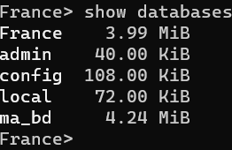</p>

- use France
<p align="center">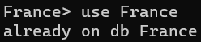</p> 

- show collections
<p align="center">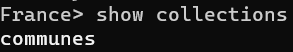</p>

- db.communes.countDocuments()
<p align="center">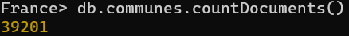</p>

- db.communes.find()
<p align="center">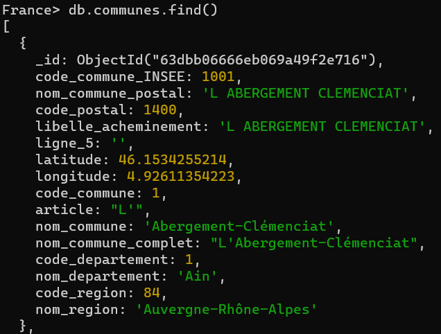</p>

- db.communes.find().pretty()
Même chose que la commande précédente

## 6 - Utilisation de curseurs
Test du curseur sur Studio 3T : 

<p align="center">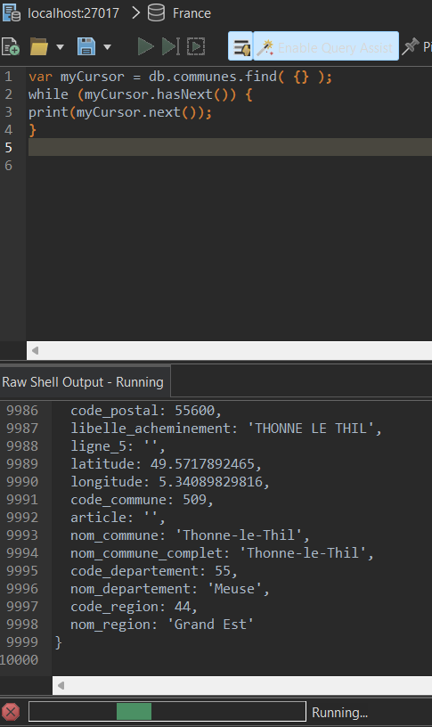</p>

## 7 - Benchmark

Nous avons créé un script qui permet de trouver un document de la collection *communes* en donnant en argument de la ligne de commande, le nom de la ville souhaité. La recherche se fait sur la colonne *nom_commune*, et nous affichons le temps que le script a mis pour trouver la donnée.
Résultat obtenu pour la commune Aranc :
<p align="center">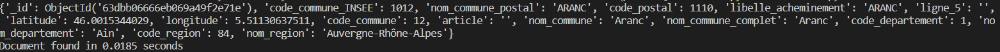</p>
Temps d'exécution : 0.0185 seconds.

## 8 - Index

L'unicité des index est possible en prenant deux colonnes :
- code_commune_INSEE
- ligne_5
En effet, comme il y a des doublons de ville, on peut ajouter la colonne ligne_5 pour avoir une valeur en plus qui permet de rendre chaque entrée unique.
Cependant, comme il est plus intéressant de rechercher une ville avec son nom par exemple, nous allons créer un index pour chacune des colonnes suivantes :
- code_commune_INSEE
- nom_commune
- code_postal

Nous testons de nouveau notre script après avoir créé un index sur la colonne *nom_commune* avec la commande :
```
db.communes.createIndex({ nom_commune : 1})
```
Résultat obtenu : 
<p align="center">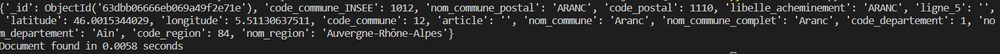</p>
Temps d'exécution : 0.0058 secondes

Nous avons ainsi gagné 0.0127 secondes, ce qui correspond à 12.7 ms.

## 9 - Base de données Analytics et incrémentation

Nous créeons la BDD Analytics et ajoutons le premier objet : 
<p align="center">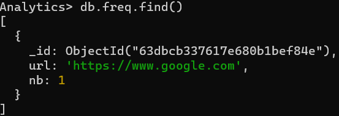</p>

Nous exécutons ensuite la commande permettant d'incrémenter l'attribut nb du document :
<p align="center">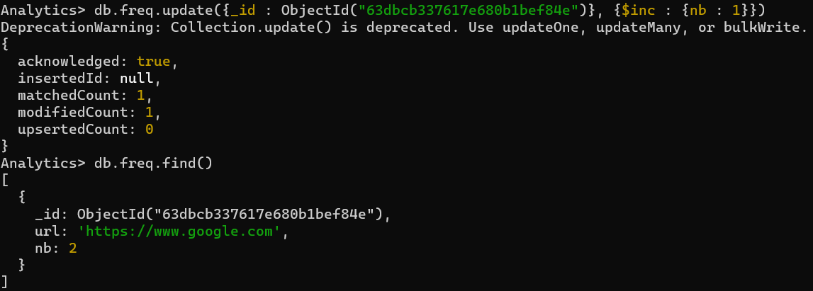</p>

## 10 - Utilisation d'Array dans les documents

Nous créons la BDD Mailing et y ajoutons l'objet list qui contient un attribut name et un attribut emails, qui est un tableau de chaines de caractères : 

<p align="center">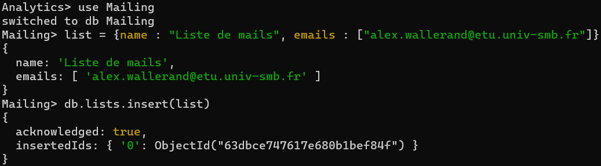</p>

On ajoute une nouvelle adresse mail au tableau de la list, avec *$push* : 
```
db.lists.update({_id : ObjectId("63dbce747617e680b1bef84f")}, {$push : {emails : "Marc-Philippe.Huget@univ-smb.fr"}})
```

<p align="center">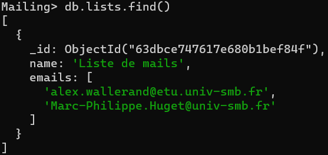</p>

Pour retier un élément du tableau, on peut reprendre la même ligne de commande que précédemment et modifié le *$push* avec *$pull*.

## 11 - Liaison des documents

Pour effectuer cette liaison on supprime la collection *lists*, et on la recréé, en initialisant le tableau mails vide. Puis à l'aide la commande suivante : 
```
db.users.find().forEach((user) => { db.lists.update({ _id: ObjectId("63dbda967617e680b1bef853") }, { $push: { users: user._id }})})
```
Elle récupère d'abord l'ensemble des utilisateurs de la collection *users*, puis pour chacun d'eux, elle les ajoute à la liste.

Nous codons enfin un script Python qui récupère la list dans la collections *lists*, et qui prend son attribut *users*, et parcoure les id à l'intérieur de ce tableau. Puis on recherche l'id correspondant dans la collection *users*.
## 12 - Ajout de user avec des droits

## 13 - Map Reduce

Pour effectuer le Map Reduce qui compte le nombre de communes en Auvergne Rhônes Alpes qui commence par un A, on créé les fonctions Map et Reduce suivantes : 
```
var mapFunctionA=function(){if(this.code_region == 84 && this.nom_commune.charAt(0) == "A" )emit(this.nom_commune,1);}

var reduceFunction = function(nom,index){return Array.sum(index);}
``` 

Puis on entre la ligne de commande suivante :
```
db.communes.mapReduce(mapFunctionA,reduceFunction,{out:"mapReduce"})
```

On obtient finalement les résultats suivants :
<p align="center">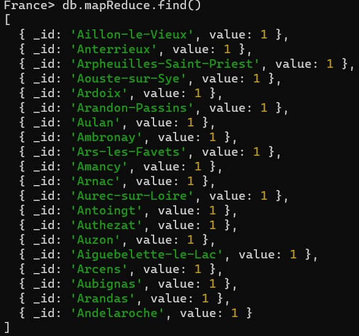</p>

## 14 - Sauvegarde et restauration des données

## 15 - Aggrégation